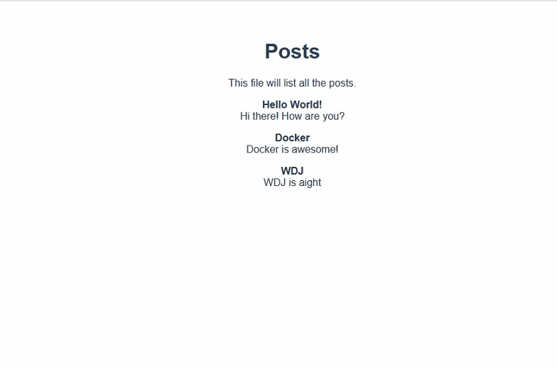
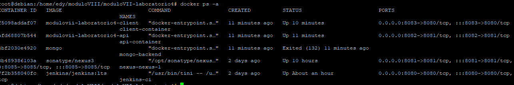

# PROYECTO:MÓDULO VIII - LABORATORIO 5
1.  Desplegar Jenkins con Docker y adicionar un esclavo (Puede ser la VM debían que se creó durante clases u otra de su preferencia)
2. Crear un repositorio en GitHub y subir al mismo su docker-compose.yml  con las herramientas de nexus y jenkins (no subir su folder "jenkins_home" al repositorio)
3. Crear un Job que levante sus servicios de backend y frontend  dentro del esclavo configurado.

- Enviar la URL del repositorio de jenkins
Subir un video donde se muestre la ejecución del job y adjuntar los logs del mismo.
EL REPOSITORIO QUE SE DEBE CLONAR AL MOMENTO DE CREAR EL JOB ES:
docker-compose.yml
    ```commandline
    https://github.com/edytarqui3/modulo8-laboratorio4
    ```
    Dockerfile
    ```commandline
    https://github.com/edytarqui3/modulo8-laboratorio4/blob/main/server/Dockerfile
    ```
- ->Enviar la URL de su repositorio de Frontend.
    ```commandline
    https://github.com/edytarqui3/modulo8-laboratorio4/tree/main/client
    ```
- ->Incluir un detalle del orden en el que se debe levantar los servicios (db, backend, frontend)
    ```
    version: '3.8'
    services: 
    mongo:
        container_name: mongo-contenedor
        image: mongo
        expose: 
        - "27017"
        ports: 
        - "27017:27017"
        volumes: 
        - apiDB:/data/db
    api:
        container_name: api-contenedor
        restart: always
        build: ./server
        ports: 
        - "8081:8081"
        depends_on: 
        - mongo
    client:
        container_name: client-contenedor
        restart: always
        build: ./client
        ports: 
        - "8080:8080"
        depends_on: 
        - api


    volumes: 
    apiDB:
    ```

# Integrantes
1. Edy Felix Tarqui Guarachi  

# Intrucciones
Este README, cuenta con los pasos para levantar en ambientes de desarrollo la App de MiniKardex, desarrollado con  :

- [x] Frontend (Vuejs)
- [x] MongoDB (with Mongoose schemas)
- [x] Backend (Node Express + mongo) 

### Pasos docker ###
```commandline
docker compose-compose up -d 
```
### Ejecucion ###


### Ejecucion servicios docker ###

